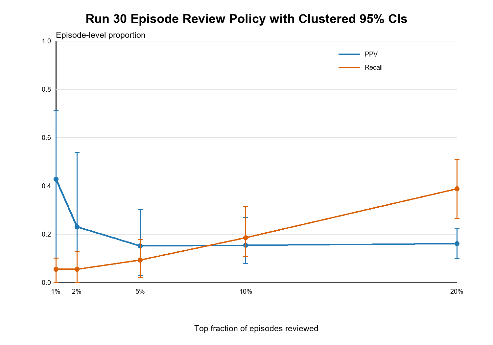

# CVCML

Leakage-audited machine learning for seven-day central-venous-catheter-associated bloodstream infection risk using longitudinal critical-care data.

> **Research prototype. Not for clinical use.** The modeled endpoint is a strict CVC-associated BSI proxy, not adjudicated NHSN CLABSI.

## Project In One View

CVCML began as a static XGBoost model and evolved into an episode-based daily landmark pipeline. The work reconstructs central-line exposure periods, screens blood-culture organisms and plausible secondary sources, separates development from temporal evaluation, and evaluates the score as a bounded infection-prevention review list rather than an interruptive bedside alarm.

The strongest finding is methodological rather than promotional: performance that initially appeared strong fell substantially after correcting outcome-dependent reference times, longest-line selection, and outcome-adjacent features. The final leakage-safe candidate showed modest discrimination and little calibration improvement over a prevalence-only predictor.

| Final evaluation | Result |
|---|---:|
| Development-validation period | 2017-2019 |
| ROC-AUC | 0.612 (95% CI 0.518-0.703) |
| PR-AUC | 0.065 (95% CI 0.041-0.113) |
| Outcome prevalence | 4.25% |
| Brier Skill Score | 0.005 (95% CI -0.019-0.021) |
| Top 10% episode-review PPV | 15.4% |
| Top 10% episode-review recall | 18.5% |

These values describe retrospective research performance. They do not establish clinical utility or transportability.

## What Changed Scientifically

1. **Static development:** compared logistic regression, random forest, and XGBoost with static and laboratory features.
2. **Leakage auditing:** replaced total dwell time with time known at prediction, removed outcome-derived culture indicators, and challenged site-documentation and care-intensity proxies.
3. **Outcome refinement:** moved from broad positive-culture labels to a strict CVC-associated BSI proxy with organism logic and partial secondary-source screening.
4. **Dynamic framing:** generated daily landmarks with one seven-day target and explicit discharge, death, and line-removal censoring context.
5. **Temporal discipline:** trained on 2008-2013, calibrated on 2014-2016, developed/evaluated on 2017-2019, and protected 2020-2022 as a temporal lockbox during model development.
6. **Operational evaluation:** reported patient-clustered uncertainty, calibration, review-list PPV/recall, false reviews per true positive, subgroup behavior, and error patterns.
7. **External evidence:** tested feasibility in eICU-CRD and label-component transportability in ARMD-MGB; neither supported full external model validation.

## Repository Map

- [`src/experiments`](src/experiments): complete run history. Runs 0-14 are historical development; Runs 15-34 contain the v0.5 redesign, validation, characterization, and reporting pipeline.
- [`results/final`](results/final): publication-style figures and the final model card. No row-level derived data or fitted models are included.
- [`docs/RUN_INDEX.md`](docs/RUN_INDEX.md): concise map from each run to its purpose.
- [`docs/REPRODUCIBILITY.md`](docs/REPRODUCIBILITY.md): data access, local configuration, and execution guidance.
- [`docs/PUBLICATION_AUDIT.md`](docs/PUBLICATION_AUDIT.md): disclosure and licensing decisions for this public release.

## Data Availability

This repository does **not** redistribute MIMIC-IV, MIMIC-IV-Note, eICU-CRD, ARMD-MGB, or derived patient-, admission-, stay-, episode-, landmark-, culture-, prediction-, or accession-level files. Authorized researchers must obtain each source directly from PhysioNet and run the code locally under the applicable credentialed data use agreement. See [`DATA_ACCESS.md`](DATA_ACCESS.md).

The MIT license applies only to original software and repository-authored documentation. It does not grant rights to source data, derived datasets, trained models, or third-party materials; see [`NOTICE.md`](NOTICE.md).

## Current Interpretation

The final model is best understood as a transparent retrospective experiment in infection-prevention review prioritization. It is not a diagnostic model and is not ready for deployment. The project contributes an auditable example of how cohort construction, outcome definition, leakage control, calibration, and workflow burden can materially change the apparent value of a clinical prediction model.

## Citation

Use [`CITATION.cff`](CITATION.cff) when citing the software repository. Dataset citations and key methodological references are listed in the comprehensive report.
